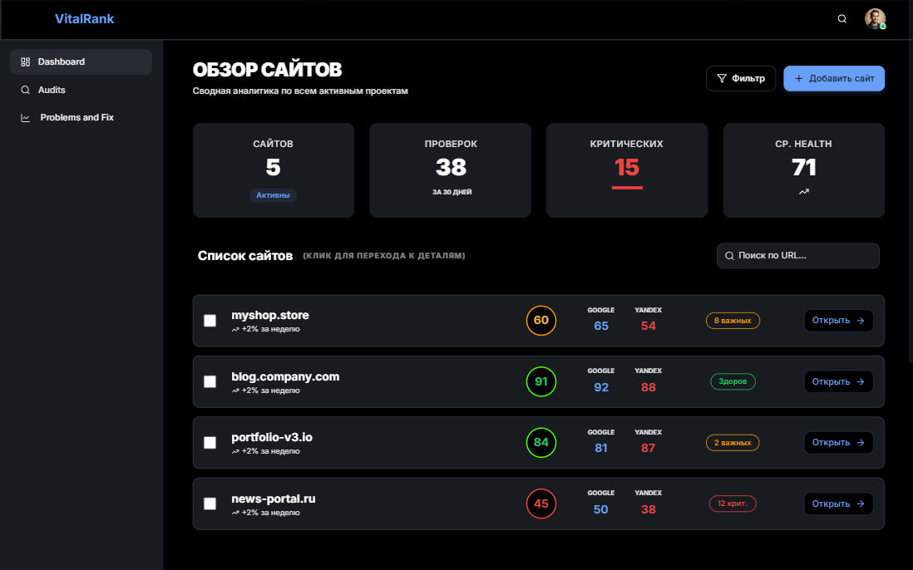
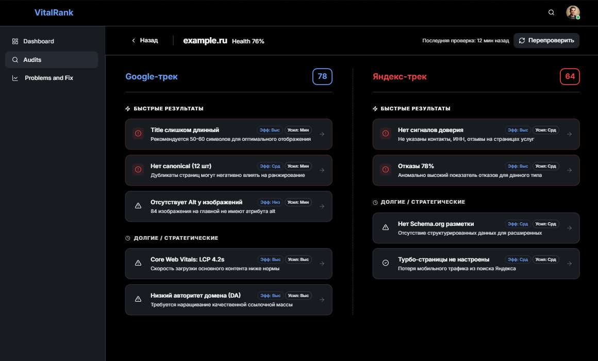
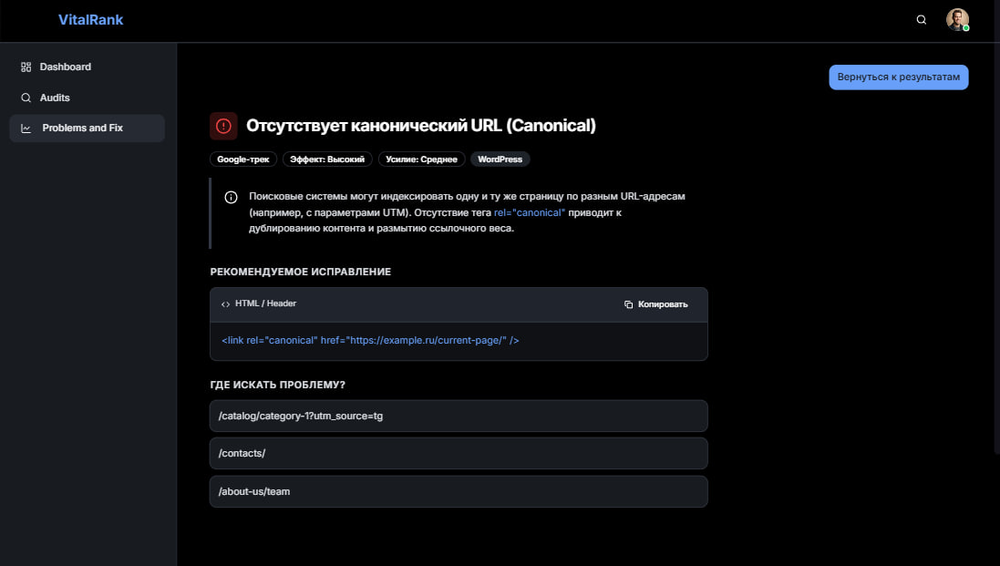
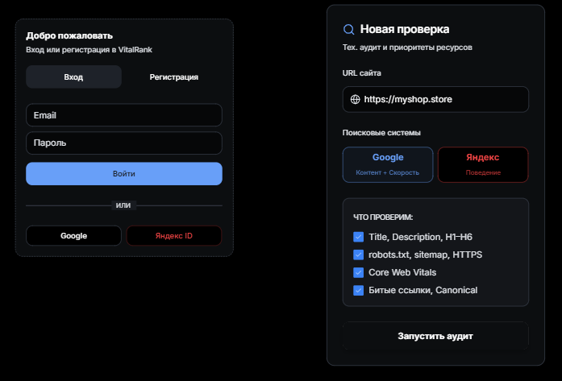

# 🔍 VitalRank

**Осмотр. Диагноз. Рост.**

---

## Что такое VitalRank

Большинство SEO-чекеров смотрят на сайт через одно усреднённое стекло. Они выдают список ошибок, не разделяя, что важно для Google, а что — для Яндекса. А разница принципиальная: Google сильнее весит контент и ссылочную массу, Яндекс — поведенческие и коммерческие факторы. VitalRank ставит сайту не один общий диагноз, а два параллельных: по логике Google и по логике Яндекса. Для каждой системы решаем, какие ошибки реально критичны, а какие — шум.

Рекомендации сортируются не по шаблонным меткам «критично/важно/неважно», а по соотношению **эффект/усилие**. Сразу видно, что чинить первым, чтобы получить быстрый результат без лишней возни.

---

## 🖥 Вот так вас встречает сайт

Первый экран — лендинг. Никакого визуального шума: чёрный фон, крупная типографика и два понятных действия. Мы сразу говорим, зачем вы здесь: превращаем сложные технические данные в понятную стратегию роста. Хотите — проверьте свой сайт, хотите — посмотрите пример отчёта.

---

## 📊 Главная панель: всё под рукой

Dashboard — это ваш командный центр. Вверху четыре цифры: сколько сайтов подключено, сколько проверок сделано, сколько критичных проблем требует внимания и средний health-score по всем проектам. Ниже — список сайтов с цветовыми кольцами: зелёное — всё в порядке, красное — пора разбираться. Для каждого сайта сразу видны отдельные оценки под Google и под Яндекс.

---

## 🔬 Два диагноза вместо одного

Открываете конкретный сайт — и видите сплит-скрин: слева Google-трек, справа — Яндекс. Каждая проблема получает вес по формуле эффект/усилие и попадает в одну из двух групп: **быстрые победы** (мало усилий, большой эффект) или **долгое лечение** (комплексные доработки). Не нужно гадать, с чего начать — приоритеты расставлены за вас.

---

## 🛠 Не просто указали на проблему, а дали лекарство

Кликаете на любую ошибку — и получаете не абстрактное «исправьте canonical», а конкретику: почему это важно, готовый фрагмент кода для вставки, список страниц, где проблема встречается, и подсказку под вашу CMS — WordPress, Bitrix или Tilda. Копируете, вставляете, забываете.

---

## Прочее

---

